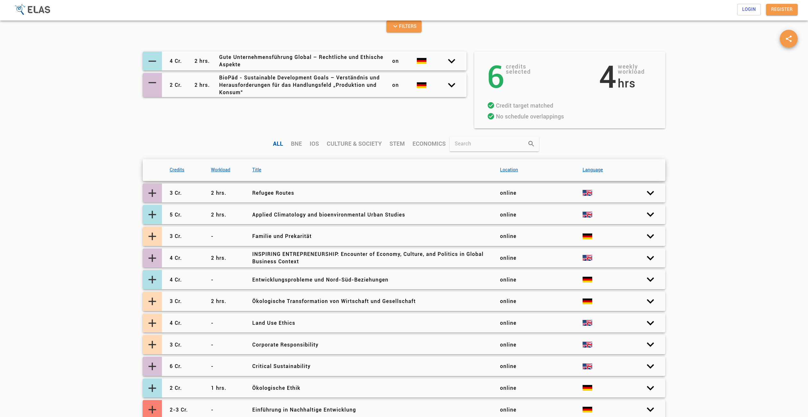
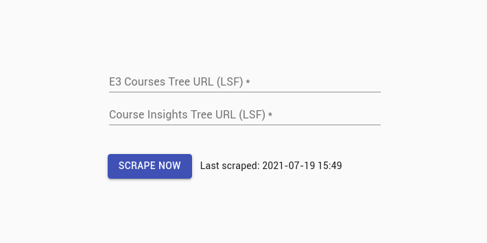
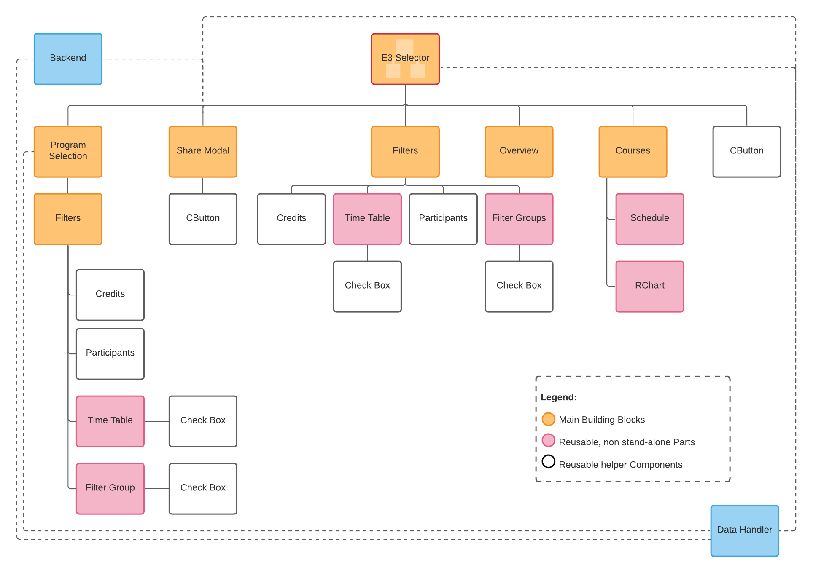
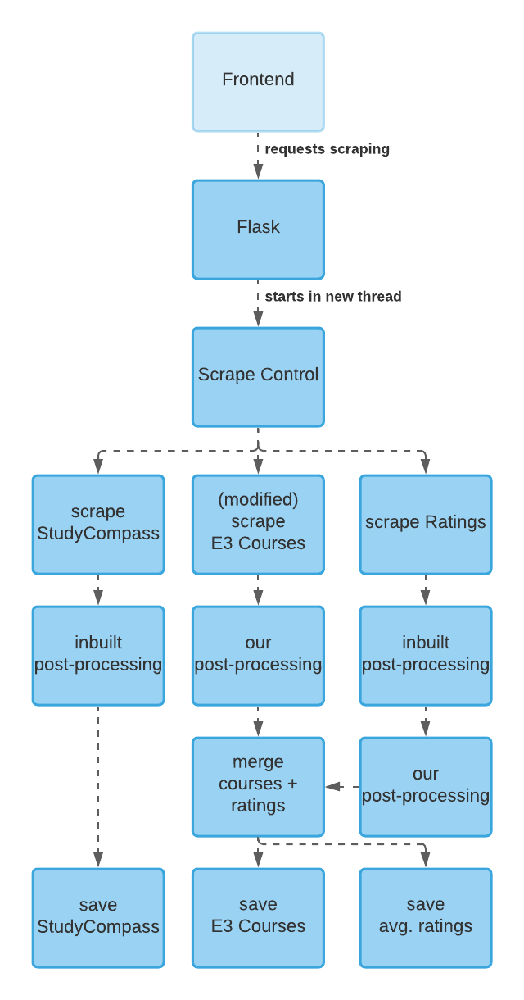

<br />
<p align="center">
  <a href="https://github.com/charludo/ELAS-Frontend">
    
  </a>


<!-- TABLE OF CONTENTS -->
1. [About E3 Selector](#about-e3-selector)
2. [Prerequisites](#prerequisites)
3. [Configuration](#configuration)
4. [Usage](#usage)
    - [Frontend](#frontend)
    - [Scraper](#scraper)
4. [Architecture](#architecture)
6. [Built by](#built-by)


<!-- ABOUT -->
## About E3 Selector

E3 Selector is the easiest way of finding, selecting and sharing E3 Courses. Powerfull filtering-, search- and sorting-capabilities make finding interesting courses fitting individual needs easy. E3 Selector keeps track of all selections and warns if there are problems with a selection.

A finished selection can easily be saved for later, or shared with others!

## Prerequisites

### Frontend Dependencies

E3 Selector relies on these additional libraries:
```console
"material-ui-search-bar": "^1.0.0",
"node-sass": "^6.0.0",
"sass-loader": "^10.1.1",
"react-share": "^4.4.0",
"react-svg-radar-chart": "^1.3.0",
```

As of the writing of this README, MUI SearchBar has a version conflict with the current React version. This however can safely be ignored with: `npm i --save material-ui-search-bar --legacy-peer-deps`

`npm start` will start the frontend server. Apart from sharing and scraping, the project will run at this point.

### Backend Dependencies

The backend provides an API endpoint for storing and requesting shared selection- and filter-states. For this, no new dependencies are introduced.

### Scraper Dependencies

However, the modified scraper and its integration written by our group do introduce some new requirements:

#### PyPI packages

```console
PyYAML==5.4.1
```

#### Other projects

These have to be cloned into a user-oned directory alongside ELAS; they do not need to be placed into the ELAS project structure:
- [uni-due-course-scraper](https://github.com/nasso48/uni-due-course-catalog-scraper)
- [course-ratings](https://github.com/charludo/course-ratings)

**Only the linked forks / branches will work.** Make sure to also install their respective dependencies.

#### Python Version

The scrapers and the data-postprocessing bump the required python version to `3.9`. The cleanest way is a fresh install.

Another way to satisfy this would be to...

- activate your `venv`, then upgrade python as you normally would
- afterwards, some PyPI packages may need to be updated as well
- lastly, make sure flask is started using python 3.9:
	```console
	(venv) $ nano $(which flask)
	```

	Set the python version to 3.9 here.

## Configuration

1. Frontend:

	In `/src/components/Projects/E3Selector/DataHandler.jsx`, around line 29, set the backend and frontend URL and port.

2. Scraper:

	In `/src/components/Website/Scrape/Scrape.js`, set the backend URL and port.

	The scraper configuration is handled in `/application/scraper/config.yaml`, and expects the following settings:

	```yaml
    courseScraper: absolute path to the cloned course scraper repo, ending in [...]/uni-due-course-catalog-scraper/
    ratingsScraper: absolute path to the cloned ratings scraper repo, ending in [...]/course-ratings/
    courseInsightsTargetFile: absolute path to where the StudyCompass data should be saved. Consult with Group DIVOC.
    e3RatingsFile: absolute path to the E3 Frontend, ending in [...]/src/components/Projects/E3Selector/data/avg_ratings.json
    e3TargetFile: absolute path to the E3 Frontend, ending in [...]/src/components/Projects/E3Selector/data/e3_courses.json
    ratingsEmail: email address of account used to access meinprof.de
    ratingsPassword: password to said account
    statusMessage: auto-set by the post-processor
	```

## Usage

Once all dependencies are installed and the projects are properly configured, start flask and the npm server.

### Frontend

Visit [http://localhost:3000/e3selector/](http://localhost:3000/e3selector/)

For a short demonstration of the core functionalities, see our [advertisement video](https://youtu.be/XpPXP7ilxvE)!  
For a more indepth explanation, see [this screencast](#)!




### Scraper

Visit [localhost:3000/scrape/](localhost:3000/scrape/)

You will be greeted by something like this:



Input **both** URLs to start scraping. For example, for SoSe2021 these would be:

- `https://campus.uni-due.de/lsf/rds?state=wtree&search=1&trex=step&root120211=280741%7C276367&P.vx=kurz` for CourseInsights / StudyCompass, and
- `https://campus.uni-due.de/lsf/rds?state=wtree&search=1&trex=step&root120211=280741%7C276221%7C276682&P.vx=kurz` for E3 Selector.

Hitting "scrape" will start a total of three scrapers, for more information see [Architecture](#architecture).

The "Scrape Now" button will be greyed out, and the status will change to "running..."

**Important:** Only one scraping process can be started at any given time, independent of the client used to view the page. This was done to protect against faulty files.

The scraping process can take a while, up to 30-40 minutes are to be expected. Check the flask console output for information and error messages. However, the scraping does **not** block a flask worker thread; scraping is handed off to a new process.

After the scraper has finished, reload E3 Selector to see the new courses.

## Architecture



The frontend is a straightforward collection of components and subcomponents. Only one page exists.



This is an approximate flowchart of the scraping functionality. After the request to scrape is received, flask hands the task off to `scrape_control.py`. Three scrapers are started, for StudyCompass courses, E3 Courses, and all ratings. StudyCompass Courses and ratings are processed according to the respective specifications of the original scraper projects. Post-processing of E3 courses, and merging the correct ratings into the courses, is handled in `scrape_control.py` directly.

### What our group did

Due to python updates, the original course scraper ran into an encoding issue. After we fixed this, no further changes were necessary ro satisfy the requirements of StudyCompass.

Scraping E3 Courses required major modifications to the scraper, since the tree structure of the LSF is different. Additional informaion was also required (like the description). Due to these changes, the post processing functionality of the original scraper was not usable for our usecase, so we had to write our own. This proved a lot more tricky than expected, since a lot of the sought-after information was hidden in larger texts, with no standard way of formulating it. (See for example the function `get_exams()` in `scrape_control.py`).

Both the frontend view of the scraper and the integration of the scrapers into flask was also done by us.

## Built by

Group **LivewareProblem**, consisting of:
- Rouchda Pepouna Makwet
- Charlotte Hartmann Paludo
- Nassim Guelbi

The original repositories and commit histories can be found here:
- [https://github.com/charludo/ELAS-Frontend](https://github.com/charludo/ELAS-Frontend)
- [https://github.com/charludo/ELAS-Backend](https://github.com/charludo/ELAS-Backend)
- [https://github.com/nasso48/uni-due-course-catalog-scraper](https://github.com/nasso48/uni-due-course-catalog-scraper)
